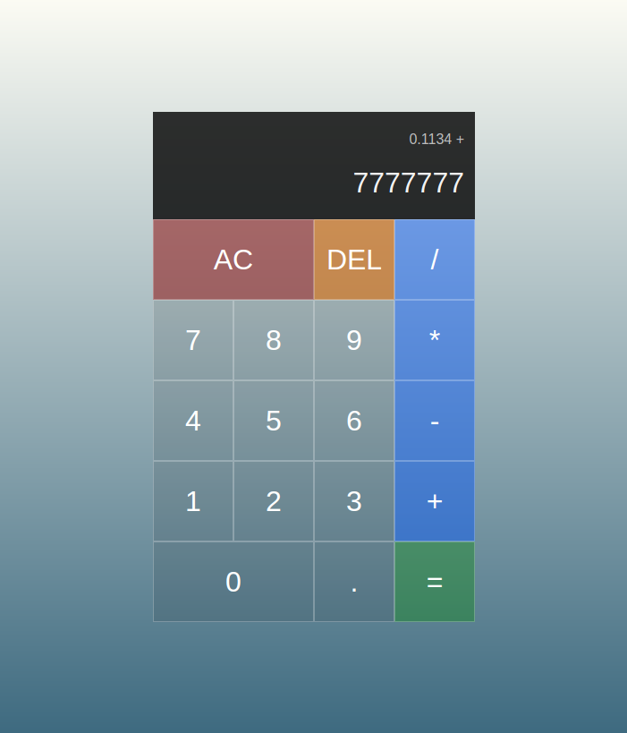

# Calculator

A calculator with basic arithmetic operators.
Do quick simple math in your browser instead of your phone.

[Try it!](https://jmilll.github.io/calculator/)

## Example

[Check it out](https://jmilll.github.io/calculator/)

## Motivation

The purpose of this project was to learn and understand Javascript events and manipulation of the Document Object Model (DOM) through user interactions.

## Technologies Used

* JavaScript
* HTML / CSS

## Features

* 2 Input types: numpad/keyboard, or point & click.
* Visual feedback: when using the keyboard, calculator buttons highlight when pressed.
* Previous operand: shows previous input and operator chosen.
* Continuous input: No need to hit "=" just press the next operator - the numbers will crunch, the result will show above, and it's ready for more numbers.

## Acknowledgements

* This project was inspired by [The Odin Project](https://www.theodinproject.com/home) online learning curriculum.

## License

MIT